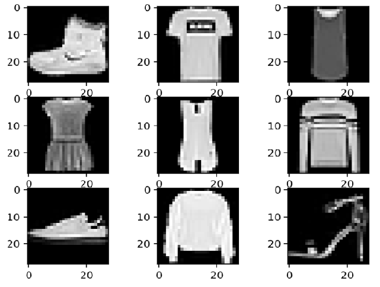
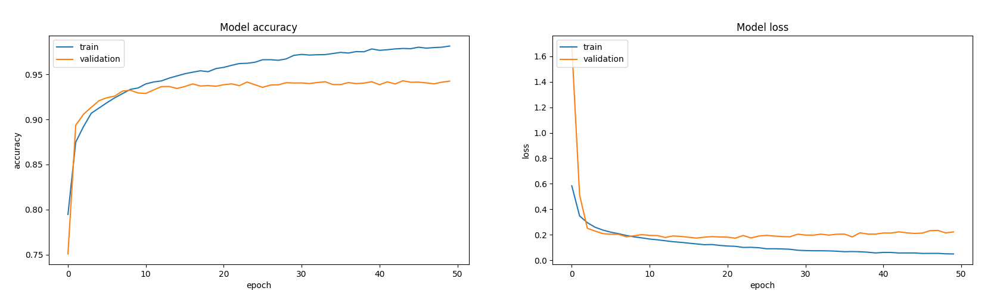

# Fashion-MNIST classification algorithms
### Introduction
Fashion-MNIST is a data set of 28x28 greyscale images of clothing pieces from 10 categories. It contains 60,000 training examples and 10,000 test examples.  
Here is an example of the data:  
  
  

 I am sharing my result achieved using a KNN algorithm and a CNN.  
## KNN
### Methods
I calculated the distance between examples using euclidean distance.
I also normalized the data by dividing the value for each pixel by 255.  
### Results
I found k=7 to give the best results, by comparing few diffrent values end evaluating the results on a validation set created from 20% of test examples.  
I got a classification error of 0.1483, which means an accuracy of 0.8517.  
It's a result comparable to those on zalando research benchmark which have an average accuracy of 0.8543.
### Usage
Run the [fashion_knn.py](https://github.com/marcinwojtasiak/MSiD-Project/blob/master/fashion_knn.py) script.

## Convolutional neural network
### Methods
I used a CNN of following architecture:
```
Model: "sequential_1"
_________________________________________________________________
Layer (type)                 Output Shape              Param #   
=================================================================
batch_normalization_1 (Batch (None, 28, 28, 1)         4         
_________________________________________________________________
conv2d_1 (Conv2D)            (None, 28, 28, 64)        640       
_________________________________________________________________
conv2d_2 (Conv2D)            (None, 28, 28, 64)        36928     
_________________________________________________________________
max_pooling2d_1 (MaxPooling2 (None, 14, 14, 64)        0         
_________________________________________________________________
dropout_1 (Dropout)          (None, 14, 14, 64)        0         
_________________________________________________________________
conv2d_3 (Conv2D)            (None, 14, 14, 64)        102464    
_________________________________________________________________
conv2d_4 (Conv2D)            (None, 14, 14, 64)        102464    
_________________________________________________________________
max_pooling2d_2 (MaxPooling2 (None, 7, 7, 64)          0         
_________________________________________________________________
dropout_2 (Dropout)          (None, 7, 7, 64)          0         
_________________________________________________________________
flatten_1 (Flatten)          (None, 3136)              0         
_________________________________________________________________
dense_1 (Dense)              (None, 256)               803072    
_________________________________________________________________
batch_normalization_2 (Batch (None, 256)               1024      
_________________________________________________________________
dropout_3 (Dropout)          (None, 256)               0         
_________________________________________________________________
dense_2 (Dense)              (None, 10)                2570      
=================================================================
Total params: 1,049,166
Trainable params: 1,048,652
Non-trainable params: 514
_________________________________________________________________
```
It has two pairs of convolutional layers, each followed by a max pooling layer and then two fully connected layers. I tested few diffrent architectures and this one proved to give the best results.  
I have set the filter size of the first two conv layers to be smaller in order to pick up more detiled features and then a bigger filter to detect bigger features.
Flatten layer changes the dimensions so that they fit the Dense layer.

Preprocessing:  
Data normalization - divided value for each pixel by 255.

Training set - validation set: 80% - 20%

I used dropout to prevent overfitting and batch normalization to improve speed and stability of the network.

Hyperparameters aren't fine-tuned. Results could be slightly better after fine-tuning.
### Results
I achieved a loss of 0.2606 and an accuracy of 93.52% on the test set.  
| Fashion-MNIST<br>test accuracy | Fashion-MNIST<br>train accuracy | Fashion-MNIST<br>validation accuracy |
| :---: | :---: | :---: |
| 93.52% | 98.15% | 94.25%


Model gives quite good results in comparison to similar models on zalando research benchmark.
### Usage
Run the [cnn.py](https://github.com/marcinwojtasiak/MSiD-Project/blob/master/cnn.py) script. The model will be saved to [trained_model](https://github.com/marcinwojtasiak/MSiD-Project/tree/master/trained_model).
There is my trained CNN in [trained_model](https://github.com/marcinwojtasiak/MSiD-Project/tree/master/trained_model), which can be loaded using keras.model.load_model.
